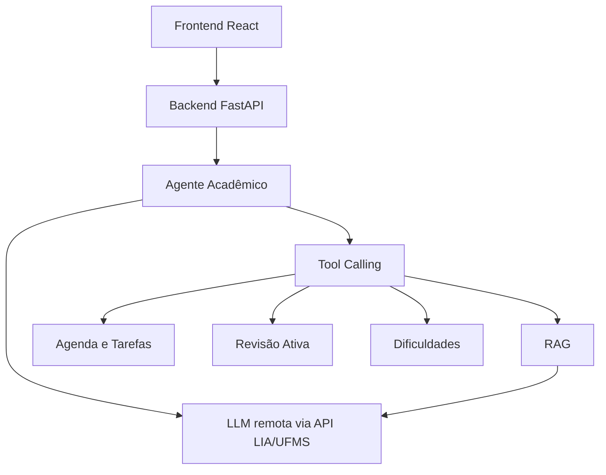

# JARVIS Acadêmico — Assistente com RAG, LLM remota e Tool Calling


> Assistente acadêmico desenvolvido para apoiar estudantes na organização dos estudos e na compreensão de conteúdos de Inteligência Artificial, combinando **RAG**, **LLM remota OpenAI-compatible**, **tool calling**, upload de documentos, revisão ativa e painel de evidências técnicas.

## Links principais

- **Sistema online:** https://teoz08-jarvis-academico.hf.space
- **Hugging Face Spaces:** https://huggingface.co/spaces/TeoZ08/jarvis-academico
- **Repositório GitHub:** https://github.com/TeoZ08/jarvis-academico

---

## Sumário

- [Objetivo do projeto](#-objetivo-do-projeto)
- [Identidade visual](#-identidade-visual)
- [Critérios de avaliação atendidos](#-critérios-de-avaliação-atendidos)
- [Funcionalidades principais](#-funcionalidades-principais)
- [Origem dos dados do dataset](#-origem-dos-dados-do-dataset)
- [Arquitetura](#-arquitetura)
- [RAG](#-rag)
- [Integração com LLM remota](#-integração-com-llm-remota)
- [Tool calling](#-tool-calling)
- [Avaliação, erros e governança](#-avaliação-erros-e-governança)
- [Checklist do Trabalho 2](#-checklist-do-trabalho-2)
- [Como executar localmente](#-como-executar-localmente)
- [Como testar](#-como-testar)
- [Deploy](#-deploy)
- [Segurança](#-segurança)
- [Tecnologias utilizadas](#-tecnologias-utilizadas)
- [Estrutura de pastas](#-estrutura-de-pastas)
- [Limitações conhecidas](#-limitações-conhecidas)

---

## Objetivo do projeto

O **JARVIS Acadêmico** foi criado como um copiloto de estudos para alunos de Computação. O sistema ajuda o estudante a consultar materiais, tirar dúvidas, organizar a rotina acadêmica e praticar conceitos por meio de revisão ativa.

O projeto tem como objetivos principais:

- responder dúvidas sobre conteúdos acadêmicos;
- consultar materiais cadastrados por meio de RAG;
- gerar planos de estudo;
- sugerir exercícios;
- registrar dificuldades do aluno;
- iniciar sessões de revisão ativa;
- registrar evidências técnicas de tool calling;
- demonstrar integração real com a LLM remota fornecida para o trabalho;
- apoiar o aprendizado de forma transparente e rastreável.

---

## Identidade visual

A identidade atual usa o símbolo aprovado **F01 / C01 — Convergência orbital**, criado para representar três trajetórias orbitais, múltiplas fontes, síntese, decisão e aprendizagem contínua.

A interface possui **tema escuro como padrão** e **tema claro opcional persistido** em `localStorage` pela chave `jarvis-theme`.

```text
Charcoal Black no escuro + Porcelain Lavender no claro + marca orbital malva/lavanda
```

Paleta principal:

- escuro: Charcoal Black `#2B2B2B`, superfícies grafite-malva e texto lavanda claro;
- claro: Porcelain Lavender `#F4F1F5`, superfícies branco-lavanda e texto Charcoal;
- marca no escuro: Ash Lavender `#A49CA6`;
- marca no claro: Deep Mauve `#5D536B`.

O verde fica restrito a estados semânticos de sucesso, concluído ou online. A marca, o avatar do assistente, o item ativo, o RAG e os botões principais usam a cor de marca de cada tema. A área principal do chat apresenta o contexto como **Disciplina — Inteligência Artificial**, sem limitar o produto a uma prova específica.

Assets de produção ficam em:

```text
frontend/public/brand/
```

Detalhes completos estão em:

```text
docs/BRAND_IDENTITY.md
```

---

## Critérios de avaliação atendidos

| Critério | Peso | Evidência no projeto |
|---|---:|---|
| **Funcionalidade** | 20% | Chat, upload, tarefas, agenda, revisão ativa, plano de estudos e deploy online. |
| **RAG** | 20% | Chunking, recuperação de documentos, fontes, scores e uso de contexto na resposta. |
| **Tool calling** | 15% | Ferramentas internas acionadas pelo agente e exibidas no painel de evidências. |
| **Avaliação + erros** | 20% | Fallback acadêmico, tratamento de timeout, token inválido, ausência de contexto e diagnóstico da LLM. |
| **Aprendizado** | 15% | Explicações, exercícios, plano de estudos, revisão ativa e registro de dificuldades. |
| **Engenharia** | 10% | React, FastAPI, Docker, testes, variáveis de ambiente, GitHub e Hugging Face Spaces. |

---

## Funcionalidades principais

### Chat acadêmico

O usuário conversa com o JARVIS sobre temas da disciplina de Inteligência Artificial e conceitos gerais de Computação.

Exemplos:

```text
O que é RAG?
Explique regressão logística.
O que é heap?
Monte um plano de estudos para a prova de IA.
Gere 3 exercícios sobre embeddings.
```

### RAG com fontes

O sistema recupera trechos dos materiais cadastrados e usa esses trechos como contexto para a resposta da LLM.

A interface exibe:

- fontes recuperadas;
- score de similaridade;
- chunks utilizados;
- método de recuperação;
- evidência de uso do RAG.

### Upload de documentos

O usuário pode anexar documentos pela interface.

Formatos previstos:

- `.md`;
- `.txt`;
- `.pdf`.

Os arquivos enviados são processados, divididos em chunks e incorporados ao mecanismo de recuperação.

### Revisão ativa

O sistema permite iniciar sessões de revisão ativa. A ideia é gerar uma pergunta com base nos materiais, receber a resposta do aluno e avaliar a resposta usando a LLM remota.

Essa funcionalidade contribui diretamente para o critério de **aprendizado**, pois transforma o assistente em uma ferramenta de prática, não apenas de consulta.

### Registro de dificuldades

O JARVIS pode registrar dificuldades do aluno, como:

```text
Registre que tenho dificuldade em BM25.
```

Essas dificuldades podem ser usadas posteriormente para melhorar planos de estudo e priorizar revisões.

### Fallback acadêmico

Quando o tema perguntado não aparece nos materiais cadastrados, o sistema não inventa fonte. Ele informa que não encontrou o tema no dataset e responde com conhecimento geral do modelo, sinalizando a origem da resposta.

Exemplo:

```text
Não encontrei esse tema nos materiais cadastrados.
Vou responder com meu conhecimento geral da base de dados do modelo.
```

Esse comportamento melhora a transparência e reduz o risco de alucinação.

---

## Origem dos dados do dataset

A versão inicial do dataset do JARVIS Acadêmico foi criada por nós em formato Markdown.

Elaboramos esses documentos com base no nosso entendimento dos conteúdos trabalhados ao longo da disciplina de Inteligência Artificial, nas atividades práticas desenvolvidas, nas discussões realizadas em aula e nos temas necessários para implementar o trabalho prático.

Os conteúdos foram organizados para cobrir os principais tópicos utilizados pelo sistema, incluindo:

- RAG;
- BM25;
- embeddings;
- FAISS;
- KNN;
- normalização;
- gradiente descendente;
- regressão linear;
- regressão logística;
- tool calling.

Como não tivemos uma base única de slides oficiais para todos esses tópicos, os textos do dataset inicial não devem ser interpretados como material oficial da disciplina. Eles representam uma base acadêmica inicial, produzida por nós, para permitir a implementação, teste e avaliação do mecanismo de RAG do JARVIS.

Além dessa base inicial, o sistema permite importar novos documentos, como arquivos `.pdf`, `.txt` e `.md`. Esses arquivos são processados, divididos em chunks e incorporados ao mecanismo de recuperação.

### Tipo de conteúdo

- Textos curtos explicativos em Markdown.
- Conteúdo acadêmico introdutório.
- Materiais produzidos por nós com base no entendimento das aulas e atividades.
- Temas alinhados ao trabalho prático e aos conceitos estudados na disciplina.

### Limitações do dataset

- Os textos são sintéticos e resumidos.
- Os documentos iniciais não substituem bibliografia oficial, livros, artigos ou materiais completos do professor.
- Algumas definições podem ser mais gerais, pois foram produzidas com base no nosso entendimento.
- Perguntas muito específicas podem não ter resposta suficiente no contexto.
- A qualidade das respostas depende diretamente da qualidade e abrangência dos documentos cadastrados.

> [!IMPORTANT]
> O JARVIS Acadêmico não coleta dados automaticamente da internet. A base de conhecimento é formada por documentos locais cadastrados no projeto e por materiais adicionados manualmente pelo usuário.

---

## Arquitetura



### Componentes principais

| Componente | Função |
|---|---|
| `frontend/` | Interface web em React. |
| `web_api/` | API FastAPI usada pelo frontend. |
| `src/agent.py` | Orquestra o comportamento do assistente. |
| `src/llm_client.py` | Integração com a API LLM remota OpenAI-compatible. |
| `src/rag.py` | Indexação e recuperação dos documentos. |
| `src/tools.py` | Ferramentas chamadas pelo agente. |
| `src/learning.py` | Funcionalidades de revisão ativa e dificuldades. |
| `src/storage.py` | Persistência local de dados acadêmicos. |
| `data/` | Dataset acadêmico inicial. |
| `docs/` | Documentação técnica. |
| `tests/` | Testes automatizados. |

---

## RAG

O projeto implementa RAG para recuperar trechos relevantes antes de gerar respostas.

Pipeline:

```text
Documento
   ↓
Chunking
   ↓
Indexação
   ↓
Busca lexical / híbrida
   ↓
Recuperação dos trechos relevantes
   ↓
Prompt com contexto
   ↓
Resposta gerada pela LLM
```

### Estratégias de recuperação

O sistema foi preparado para trabalhar com:

- busca lexical;
- BM25;
- embeddings;
- FAISS;
- recuperação híbrida.

No ambiente online, a configuração pode ser ajustada por variável de ambiente:

```env
RAG_MODE=hibrido
```

ou, em ambientes com pouca memória:

```env
RAG_MODE=lexical
```

### Estratégia de chunking

O sistema usa chunking por parágrafos, com limite aproximado de 700 caracteres e sobreposição de 80 caracteres quando o texto é maior que esse limite.

Escolhemos essa estratégia para manter os trechos pequenos o suficiente para uma recuperação eficiente, mas ainda com contexto suficiente para que a LLM consiga gerar respostas úteis.

---

## Integração com LLM remota

A integração usa um cliente OpenAI-compatible apontando para a API LIA/UFMS. No deploy atual, o endpoint fornecido está configurado para Qwen:

```text
Qwen/Qwen2.5-14B-Instruct-AWQ
```

Modelo configurado:

```env
GEMMA_MODEL=Qwen/Qwen2.5-14B-Instruct-AWQ
```

URL da API:

```env
GEMMA_BASE_URL=https://llm.liaufms.org/v1/qwen2-5-14b-instruct-awq
```

A chave de API deve ser configurada em variável de ambiente ou secret:

```env
GEMMA_API_KEY=sua_chave_aqui
```

A chave nunca deve ser versionada no Git.

> Observação: `GEMMA_BASE_URL`, `GEMMA_MODEL`, `GEMMA_API_KEY`, `GEMMA_TIMEOUT_SECONDS` e `GEMMA_MAX_TOKENS` são nomes legados do projeto. Eles continuam válidos para não quebrar o deploy, mas configuram a LLM remota OpenAI-compatible atual.

---

## Tool calling

O sistema implementa tool calling para permitir que a LLM acione ferramentas internas.

| Ferramenta | Função |
|---|---|
| `buscar_material_rag` | Busca trechos relevantes nos materiais. |
| `planejar_estudos` | Gera plano de estudos. |
| `listar_tarefas` | Consulta tarefas acadêmicas. |
| `consultar_agenda` | Consulta compromissos simulados. |
| `gerar_exercicios` | Cria exercícios com base nos conteúdos. |
| `iniciar_revisao_ativa` | Gera pergunta para revisão ativa. |
| `avaliar_resposta_revisao` | Avalia a resposta do aluno. |
| `registrar_dificuldade` | Registra dificuldade acadêmica. |
| `listar_dificuldades` | Lista dificuldades registradas. |

A aba **Evidências Técnicas** mostra:

- ferramenta chamada;
- entrada da ferramenta;
- saída resumida;
- fontes recuperadas;
- scores;
- fallback;
- JSON técnico bruto.

Essa tela foi criada para facilitar a correção do requisito de tool calling.

---

## Avaliação, erros e governança

O projeto possui tratamento controlado para diferentes situações.

| Situação | Tratamento |
|---|---|
| Tema fora do dataset | Fallback acadêmico com aviso explícito. |
| Token inválido | Erro controlado de autenticação. |
| Timeout | Variável `GEMMA_TIMEOUT_SECONDS`. |
| Resposta longa demais | Variável `GEMMA_MAX_TOKENS`. |
| Problema de integração com LLM | Endpoint `/api/debug/gemma-ping`. |
| Falta de evidência no RAG | Resposta informa ausência de contexto suficiente. |

### Diagnóstico da LLM

Endpoint:

```text
/api/debug/gemma-ping
```

Esse endpoint mantém o nome `gemma-ping` por compatibilidade, mas testa a comunicação direta com a LLM remota sem passar pelo fluxo completo do agente.

Exemplo de retorno esperado:

```json
{
  "ok": true,
  "modo": "gemma",
  "provider": "openai-compatible",
  "llm_provider_label": "Qwen/Qwen2.5-14B-Instruct-AWQ",
  "resposta": "OK",
  "api_key_presente": true
}
```

---

## Checklist do Trabalho 2

A conferência da segunda parte da implementação está em:

```text
docs/CHECKLIST_TRABALHO_2.md
```

O checklist mapeia planejamento de estudos, melhorias de aprendizado, avaliação com 10 perguntas, análise de erros, dataset, tool calling, integração LLM e evidências técnicas para arquivos e endpoints do projeto.

---

## Como executar localmente

### Pré-requisitos

- Python 3.12+
- Node.js
- npm
- Git

### Clonar o projeto

```bash
git clone https://github.com/TeoZ08/jarvis-academico.git
cd jarvis-academico
```

### Criar ambiente virtual

```bash
python3 -m venv .venv
source .venv/bin/activate
```

### Instalar dependências Python

```bash
pip install --upgrade pip
pip install -r requirements_cpu.txt
```

Se necessário:

```bash
pip install -r requirements.txt
```

### Criar arquivo `.env`

Na raiz do projeto:

```bash
nano .env
```

Exemplo:

```env
LLM_MODE=gemma
GEMMA_BASE_URL=https://llm.liaufms.org/v1/qwen2-5-14b-instruct-awq
GEMMA_MODEL=Qwen/Qwen2.5-14B-Instruct-AWQ
GEMMA_API_KEY=sua_chave_aqui
GEMMA_TIMEOUT_SECONDS=180
GEMMA_MAX_TOKENS=512
RAG_MODE=hibrido
EMBEDDING_MODEL=sentence-transformers/paraphrase-multilingual-MiniLM-L12-v2
PYTHONUNBUFFERED=1
```

### Rodar backend

```bash
python -m uvicorn web_api.main:app --reload
```

Backend local:

```text
http://127.0.0.1:8000
```

### Rodar frontend

Em outro terminal:

```bash
cd frontend
npm install
npm run dev
```

Frontend local:

```text
http://localhost:5173
```

---

## Como testar

### Teste de status

```text
http://127.0.0.1:8000/api/status
```

### Teste direto da LLM

```text
http://127.0.0.1:8000/api/debug/gemma-ping
```

### Testes no chat

```text
Responda apenas: OK
```

```text
O que é RAG?
```

```text
O que é heap?
```

```text
Inicie uma revisão ativa sobre RAG.
```

```text
Registre que tenho dificuldade em BM25.
```

```text
Monte um plano de estudos para a prova de IA.
```

```text
Gere 3 exercícios sobre embeddings.
```

---

## Deploy

O projeto foi preparado para deploy com Docker.

### Hugging Face Spaces

O projeto está publicado em:

```text
https://huggingface.co/spaces/TeoZ08/jarvis-academico
```

O Space utiliza:

```yaml
sdk: docker
app_port: 7860
```

### Variáveis recomendadas no Hugging Face

Variables:

```env
LLM_MODE=gemma
GEMMA_BASE_URL=https://llm.liaufms.org/v1/qwen2-5-14b-instruct-awq
GEMMA_MODEL=Qwen/Qwen2.5-14B-Instruct-AWQ
GEMMA_TIMEOUT_SECONDS=180
GEMMA_MAX_TOKENS=512
RAG_MODE=hibrido
EMBEDDING_MODEL=sentence-transformers/paraphrase-multilingual-MiniLM-L12-v2
PYTHONUNBUFFERED=1
```

Secret:

```env
GEMMA_API_KEY=sua_chave_aqui
```

> [!WARNING]
> A chave deve ser colocada em **Secrets**, não em Variables, e nunca deve ser salva no repositório.

---

## Segurança

Arquivos e informações que não devem ser versionados:

```text
.env
GEMMA_API_KEY
HF_TOKEN
tokens pessoais
chaves privadas
```

A chave da LLM deve ser usada apenas via:

- `.env` local; ou
- Secrets do Hugging Face.

---

## Tecnologias utilizadas

| Tecnologia | Uso |
|---|---|
| Python | Backend e lógica do agente. |
| FastAPI | API web. |
| React | Interface web. |
| Vite | Build do frontend. |
| Docker | Empacotamento para deploy. |
| Hugging Face Spaces | Hospedagem online. |
| OpenAI SDK | Cliente compatível com a API LLM remota. |
| Qwen / LLM LIA-UFMS | Modelo remoto configurado no endpoint atual. |
| BM25 | Recuperação lexical. |
| FAISS | Busca vetorial. |
| Sentence Transformers | Embeddings. |
| Pytest | Testes automatizados. |
| Git/GitHub | Versionamento. |

---

## Estrutura de pastas

```text
jarvis-academico/
├── data/
├── docs/
├── frontend/
│   └── src/
├── logs/
├── scripts/
├── src/
├── storage/
├── tests/
├── web_api/
├── Dockerfile
├── README.md
├── requirements.txt
└── requirements_cpu.txt
```

---

## Status do projeto

- [x] Interface web em React.
- [x] Backend em FastAPI.
- [x] Integração com LLM remota OpenAI-compatible.
- [x] RAG com fontes e scores.
- [x] Tool calling.
- [x] Upload de documentos.
- [x] Fallback acadêmico.
- [x] Painel de evidências técnicas.
- [x] Revisão ativa.
- [x] Registro de dificuldades.
- [x] Deploy com Docker no Hugging Face Spaces.
- [ ] Ampliar dataset com mais materiais reais da disciplina.
- [ ] Adicionar métricas quantitativas mais completas para avaliação do RAG.

---

## Limitações conhecidas

- A qualidade das respostas depende dos documentos cadastrados.
- Quando o tema não existe no dataset, o sistema usa fallback acadêmico.
- Deploys gratuitos podem ter limitações de memória e tempo de resposta.
- A chave da LLM deve ser configurada corretamente para uso real.
- O sistema não coleta dados automaticamente da internet.
- O conjunto inicial de documentos é pequeno e serve como base demonstrativa.

---

## IAs utilizadas no desenvolvimento

Durante o desenvolvimento do projeto, utilizamos ferramentas de Inteligência Artificial como apoio para organização, revisão, depuração e documentação do trabalho.

As IAs utilizadas foram:

- **ChatGPT**: Geração de código, apoio na estruturação do projeto, revisão de código, documentação, organização do README, análise de erros.
- **Gemini**: apoio complementar na revisão de ideias, validação de explicações e comparação de alternativas técnicas.
- **LLM remota via API LIA/UFMS**: modelo de linguagem integrado ao JARVIS Acadêmico para geração de respostas no sistema final. No endpoint atual, a configuração usa Qwen com variáveis `GEMMA_*` legadas.

Observação: as IAs foram utilizadas como ferramentas de apoio. A implementação, validação, organização do repositório e decisões finais do projeto foram realizadas pelo grupo.

---

## Autores

Projeto desenvolvido para a disciplina de **Inteligência Artificial — FACOM/UFMS** por Matteo Lima e Pedro Bertoncelo.

Repositório principal:

```text
https://github.com/TeoZ08/jarvis-academico
```

Deploy:

```text
https://huggingface.co/spaces/TeoZ08/jarvis-academico
```
